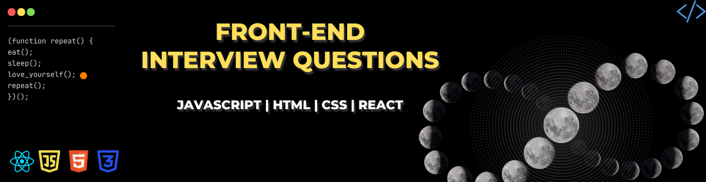

<h1 align="center">
    Front-end Interview Questions and Answers
</h1>

---

<div align="center">
    <p>
        <a name="madeWith"></a>
        <a name="license"></a>
    </p>
</div>

<div align="center">
    
</div>

<div align="center">
  <h3>A collection of commonly asked questions for Frontend Developers</h3>

  <p>
    Show your support by giving a ⭐ to this repo
  </p>
</div>

---

## Overview of the Repo

Frontend Interview Questions is an interactive interview preparation platform built using **Next.js** and **Markdown-driven content**.

All content is authored in simple `.md` files. These markdown files are parsed at build time and transformed into a rich user experience featuring:

* Question navigation
* Accordion-based answers
* Syntax highlighted code blocks
* Dark mode support
* Topic-wise categorization
<!-- * Responsive layouts -->

---

## Front-end Interview Questions with Answers by topic

- JavaScript

  - [Theoretical Questions](content/js-concepts.md)

- React

  - [Theoretical Questions](content/react-concepts.md)
  
- HTML & CSS

  - [HTML Questions](content/html-questions.md)
  - [CSS Questions](content/css-questions.md)

---

## Features

* 📚 Topic-wise interview questions
* ⚛️ React Concepts
* ⚡ JavaScript Concepts
* 🏗️ HTML Questions
* 🎨 CSS Questions
* 🌙 Dark Mode
* 📖 Markdown-based content management
* 📝 Code snippets with syntax highlighting
* 🔍 Quick question navigation
<!-- * 📱 Responsive UI -->

---

<!-- ## How the App Works

### Content Layer

All interview questions are stored as Markdown files inside the `content` directory.

Example:

```text
content/
├── react-concepts.md
├── react-machine-coding.md
├── javascript-concepts.md
├── javascript-machine-coding.md
├── html-questions.md
└── css-questions.md
```

Each question follows a simple structure:

```md
#### Q1

### Q1. What is React?

React is a JavaScript library for building user interfaces.

<div align="left">
  <b><a href="#">↥ back to top</a></b>
</div>
```

---

### Parsing Layer

The application reads Markdown files from the filesystem using:

```ts
fs.readFile()
```

The content is then parsed using a custom parser:

```ts
parseMarkdownToQuestions()
```

The parser extracts:

* Question Number
* Question Title
* Answer Content

and converts them into structured objects that can be rendered inside the UI.

---

### Rendering Layer

Markdown answers are rendered using:

```tsx
react-markdown
```

with support for:

* Bold text
* Italics
* Tables
* Ordered Lists
* Unordered Lists
* Blockquotes
* Code Blocks

---

## Tech Stack

### Framework

* Next.js 15
* React 19
* TypeScript

### Styling

* Tailwind CSS
* Shadcn UI
* Tailwind Typography

### Markdown

* React Markdown
* Remark GFM

### UI Components

* Shadcn Accordion
* Shadcn Tabs
* Shadcn Cards
* Lucide Icons

### Animations

* Animate UI

---

## Project Structure

```text
app/
├── page.tsx
├── [document]/
│   └── page.tsx

components/
├── Accordion.tsx
├── MarkdownRenderer.tsx
├── Navigation.tsx
├── QuestionNavigation.tsx
├── QuestionViewer.tsx
└── ModeToggle.tsx

content/
├── react-concepts.md
├── javascript-concepts.md
├── html-questions.md
└── css-questions.md

lib/
├── parseMarkdown.ts
├── navigation.ts
└── utils.ts
``` -->

## Running Locally

```
git clone
npm install
npm run dev
```

Application will be available at:

```text
http://localhost:3000
```

---

<!-- ## Building for Production

```bash
npm run build
```

Run production build:

```bash
npm start
``` -->

<!-- ---

## Deploying to Vercel

### Install Vercel CLI

```bash
npm install -g vercel
```

### Deploy

```bash
vercel
```

Or simply:

1. Push code to GitHub
2. Import repository into Vercel
3. Deploy

No additional configuration is required. -->

<!-- ---

## Future Enhancements

* Search functionality
* Progress tracking
* Bookmarks
* Interview Tips section
* Copy code snippets
* Syntax highlighting with Shiki
* Mobile optimized navigation -->

## License

This project is licensed under the MIT License.

---

<div align="center">
  <p>If this project helps you prepare for interviews, consider giving it a ⭐</p>
</div>
