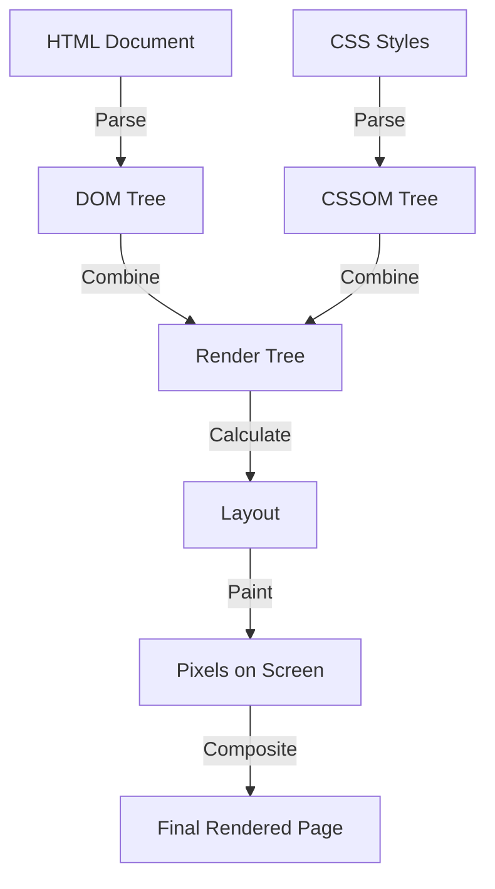

# HTML Interview Questions

## Table of Questions

<br/>

|Sl.No| Questions                                                                         |
|-----|-----------------------------------------------------------------------------------|
| 01.|[What is HTML and why is it used](#Q1)|
| 02.|[What are the new features introduced in HTML5](#Q2)|
| 03.|[New APIs introduced in HTML5](#Q3)|
| 04.|[How do you create a hyperlink in HTML](#Q4)|
| 05.|[Explain the difference between block and inline elements](#Q5)|
| 06.|[Purpose of `<head>` tag](#Q6)|
| 07.|[How to embed an image in HTML page.](#Q7)|
| 08.|[Explain semantic HTML and why is it important](#Q8)|
| 09.|[How to create a table](#Q9)|
| 10.|[Difference between HTML and XHTML](#Q10)|
| 11.|[How to include a video in HTML](#Q11)|
| 12.|[What is `doctype` used for. If you don't specify, what will happen](#Q12)|
| 13.|[DOM and DOM manipulation](#Q13)|
| 14.|[Different types of storage (local storage, session storage, cookies)](#Q14)|
| 15.|[Drag and drop in HTML5](#Q15)|
| 16.|[Form input types in HTML5](#Q16)|
| 17.|[`Datalist` tag in HTML5](#Q17)|
| 18.|[How browser renders HTML and CSS](#Q18)|
| 19.|[What are web workers](#Q19)|
| 20.|[Different types of script tags (`async`, `defer`)](#Q20)|


## Answers

#### Q1
### ✨ What is HTML and why is it used

HTML (HyperText Markup Language) is the standard markup language used to create and design webpages. Here's why HTML is essential:

1. **Structure**: HTML provides the basic structure of a webpage. Elements like headings, paragraphs, lists, and links are all defined using HTML.

2. **Content**: HTML is used to embed text, images, videos, and other multimedia on web pages.

3. **Links**: HTML allows the creation of hyperlinks, which enable users to navigate between different web pages or sections within a single page.

4. **Accessibility**: HTML supports the use of tags that enhance the accessibility of web pages, making them usable by people with disabilities. For example, semantic tags and attributes like `alt` for images improve screen reader support.

5. **SEO**: HTML elements and attributes play a crucial role in Search Engine Optimization (SEO). Proper use of tags like `<title>`, `<meta>`, and header tags help search engines understand and index content, improving visibility in search results.

6. **Integration with Other Technologies**: HTML can be used in conjunction with CSS (Cascading Style Sheets) for styling and JavaScript for dynamic and interactive content.

<div align="left">
    <b><a href="#">↥ back to top</a></b>
</div>

#### Q2
### ✨ What are the new features introduced in HTML5

HTML5 introduced several new features and enhancements to improve the functionality, performance, and user experience of web applications. Here are some key features:

1. **Semantic Elements**: New tags like `<header>`, `<footer>`, `<section>`, `<article>`, `<aside>`, and `<nav>` provide better structure and meaning to web content, improving accessibility and SEO  .

2. **Multimedia Support**: Native support for audio and video through `<audio>` and `<video>` tags. These elements include built-in controls for play, pause, and volume.

3. **Canvas Element**: The `<canvas>` element allows for dynamic, scriptable rendering of 2D shapes and images, enabling complex graphics and animations directly within the browser without external plugins.

4. **Geolocation API**: This API enables web applications to access the geographical location of a user, which can be used for mapping, local search, and other location-based services .

5. **Web Storage**: HTML5 introduces `localStorage` and `sessionStorage` for storing data on the client side. This provides a more secure and efficient way to store data compared to cookies .

6. **Offline Capabilities**: The Application Cache allows web applications to run offline by storing resources like HTML, CSS, and JavaScript files locally, ensuring that web apps are accessible even without an internet connection  .

7. **Form Enhancements**: New input types (`email`, `url`, `date`, `number`, etc.) and attributes (`placeholder`, `required`, `pattern`, etc.) enhance form validation and user experience .

8. **Drag and Drop**: HTML5 includes a drag-and-drop API that simplifies the process of dragging elements within or between web pages .

9. **New APIs**: Additional APIs such as *Web Workers* for background processing, the *History API* for managing browser history, and the *WebSocket API* for real-time communication are also part of HTML5 .

<div align="left">
    <b><a href="#">↥ back to top</a></b>
</div>

#### Q3
### ✨ New APIs introduced in HTML5

Here are some examples of the new APIs introduced in HTML5 along with small code snippets demonstrating their usage:

**1. Geolocation API**
The Geolocation API allows web applications to obtain the geographical position of the user.

```html
<!DOCTYPE html>
<html lang="en">
<head>
    <meta charset="UTF-8">
    <title>Geolocation API</title>
</head>
<body>
    <button onclick="getLocation()">Get Location</button>
    <p id="location"></p>

    <script>
        function getLocation() {
            if (navigator.geolocation) {
                navigator.geolocation.getCurrentPosition(showPosition);
            } else {
                document.getElementById('location').innerText = "Geolocation is not supported by this browser.";
            }
        }

        function showPosition(position) {
            document.getElementById('location').innerText = 
                "Latitude: " + position.coords.latitude + 
                " Longitude: " + position.coords.longitude;
        }
    </script>
</body>
</html>
```

**2. Web Storage API**
The Web Storage API provides mechanisms for storing key-value pairs in a web browser. It includes `localStorage` and `sessionStorage`.

```html
<!DOCTYPE html>
<html lang="en">
<head>
    <meta charset="UTF-8">
    <title>Web Storage API</title>
</head>
<body>
    <button onclick="storeData()">Store Data</button>
    <button onclick="retrieveData()">Retrieve Data</button>
    <p id="output"></p>

    <script>
        function storeData() {
            localStorage.setItem('name', 'John Doe');
        }

        function retrieveData() {
            const name = localStorage.getItem('name');
            document.getElementById('output').innerText = name;
        }
    </script>
</body>
</html>
```

**3. Canvas API**
The Canvas API provides a means for drawing graphics via JavaScript.

```html
<!DOCTYPE html>
<html lang="en">
<head>
    <meta charset="UTF-8">
    <title>Canvas API</title>
</head>
<body>
    <canvas id="myCanvas" width="200" height="200" style="border:1px solid #000000;"></canvas>

    <script>
        const canvas = document.getElementById('myCanvas');
        const context = canvas.getContext('2d');
        
        context.fillStyle = '#FF0000';
        context.fillRect(50, 50, 100, 100);
    </script>
</body>
</html>
```

**4. Drag and Drop API**
The Drag and Drop API allows for drag-and-drop functionality.

```html
<!DOCTYPE html>
<html lang="en">
<head>
    <meta charset="UTF-8">
    <title>Drag and Drop API</title>
</head>
<body>
    <div id="drag1" draggable="true" ondragstart="drag(event)" style="width: 100px; height: 100px; background-color: #ff0000;"></div>
    <div id="dropZone" ondrop="drop(event)" ondragover="allowDrop(event)" style="width: 200px; height: 200px; border: 1px solid #000000;"></div>

    <script>
        function allowDrop(ev) {
            ev.preventDefault();
        }

        function drag(ev) {
            ev.dataTransfer.setData("text", ev.target.id);
        }

        function drop(ev) {
            ev.preventDefault();
            const data = ev.dataTransfer.getData("text");
            ev.target.appendChild(document.getElementById(data));
        }
    </script>
</body>
</html>
```

**5. Web Workers API**
Web Workers API allows running scripts in background threads.

```html
<!DOCTYPE html>
<html lang="en">
<head>
    <meta charset="UTF-8">
    <title>Web Workers API</title>
</head>
<body>
    <button onclick="startWorker()">Start Worker</button>
    <p id="result"></p>

    <script>
        let worker;

        function startWorker() {
            if (typeof(Worker) !== "undefined") {
                if (typeof(worker) == "undefined") {
                    worker = new Worker("worker.js");
                }
                worker.onmessage = function(event) {
                    document.getElementById("result").innerText = event.data;
                };
            } else {
                document.getElementById("result").innerText = "Sorry, your browser does not support Web Workers...";
            }
        }
    </script>
</body>
</html>
```

***worker.js***:
```javascript
let i = 0;

function timedCount() {
    i = i + 1;
    postMessage(i);
    setTimeout(timedCount, 500);
}

timedCount();
```

**6. Offline Capabilities (Application Cache)**
The Application Cache API allows a web application to run offline.

```html
<!DOCTYPE html>
<html lang="en" manifest="example.appcache">
<head>
    <meta charset="UTF-8">
    <title>Application Cache</title>
</head>
<body>
    <h1>Application Cache Example</h1>
    <p>This web page is cached for offline use.</p>
</body>
</html>
```

***example.appcache***:
```plaintext
CACHE MANIFEST
# 2023-05-30:v1

CACHE:
index.html

NETWORK:
*
```

<div align="left">
    <b><a href="#">↥ back to top</a></b>
</div>

#### Q4
### ✨ How do you create a hyperlink in HTML

To create a hyperlink using JavaScript and manipulate the DOM (Document Object Model), you can follow these steps:

1. *Create an anchor element (`<a>`).*
2. *Set the attributes (`href`, `target`, etc.).*
3. *Set the link text.*
4. *Append the anchor element to the desired location in the DOM.*

Example:

```html
<!DOCTYPE html>
<html lang="en">
<head>
    <meta charset="UTF-8">
    <title>Create Hyperlink with JavaScript</title>
</head>
<body>
    <div id="link-container"></div>

    <script>
        // Step 1: Create an anchor element
        const link = document.createElement('a');

        // Step 2: Set the href attribute and other properties
        link.href = 'https://www.example.com';
        link.target = '_blank'; // Open link in a new tab
        link.title = 'Go to Example.com';

        // Step 3: Set the link text
        link.textContent = 'Visit Example.com';

        // Step 4: Append the anchor element to the desired location
        document.getElementById('link-container').appendChild(link);
    </script>
</body>
</html>
```

<div align="left">
    <b><a href="#">↥ back to top</a></b>
</div>

#### Q5
### ✨ Explain the difference between block and inline elements

In HTML, elements are categorized into two main types: *block elements* and *inline elements*. The key differences between these types lie in their default behavior and layout characteristics.

|Features         | Block Elements                    | Inline Elements                   |
|-----------------|-----------------------------------|-----------------------------------|
| **Default Behavior**| Block elements always start on a new line and take up the full width available | Inline elements do not start on a new line. They sit within the flow of the surrounding content and only take up as much width as necessary |
| **Content**| They typically contain other block elements and inline elements like paragraphs, lists, and divs | They generally contain text or other inline elements. They are used for elements that need to be part of a line, such as links, emphasis, or images |
| **Layout**| They form a block-like structure, and their height and width can be controlled using CSS properties.  | Inline elements cannot have their width and height adjusted using CSS. Margins and padding can be applied but only affect spacing horizontally.  |
| **Common Block Elements**| `<div>`, `<p>`, `<h1>`, `<ul>`, `<ol>`, `<li>`, `<table>`, `<section>`, `<article>`, `<header>`, `<footer>`  | `<span>`, `<a>`, ``, `<strong>`, `<em>`, `<label>`, `<input>`, `<br>`, `<code>`  |

### Visual Representation
Imagine a web page layout:
- **Block Elements**: Think of them as building blocks stacked vertically. Each block (like a paragraph or a section) occupies its line.
- **Inline Elements**: Think of them as words within a sentence. They flow within the block elements and fit together horizontally.

<div align="left">
    <b><a href="#">↥ back to top</a></b>
</div>

#### Q6
### ✨ Purpose of `<head>` tag

The `<head>` tag in HTML serves several essential purposes. It contains metadata and links to resources necessary for rendering the webpage correctly but does not display content directly on the page. Here are the primary functions of the `<head>` tag:

1. **Metadata**:
The `<head>` section contains metadata about the HTML document, which provides information about the page to browsers, search engines, and other services.

- **Title**: The `<title>` tag sets the title of the webpage, displayed on the browser tab.

- **Meta Tags**: These provide additional metadata such as character set, author, description, and keywords.

2. **Links to External Resources**:
The `<head>` tag includes links to external resources required for the page.

- **Stylesheets**: Links to CSS files to style the webpage.

- **Scripts**: Links to JavaScript files, typically those that should be loaded before the content.

- **Favicon**: A link to the favicon, which is the small icon displayed in the browser tab.

3. **SEO and Accessibility**:
The `<head>` section includes elements that improve SEO and accessibility.

- **Open Graph Tags**: Used by social media platforms to display rich content when links are shared.

- **Charset Declaration**: Specifies the character encoding for the HTML document.

4. **Performance and Optimizations**:
- **Preconnect and Prefetch**: These tags help in improving performance by preconnecting to required domains and prefetching resources.

**Example of a Complete `<head>` Tag**:
```html
<head>
    <title>My Webpage</title>
    <meta charset="UTF-8">
    <meta name="description" content="An example webpage">
    <meta name="keywords" content="HTML, CSS, JavaScript">
    <meta name="author" content="John Doe">
    <link rel="stylesheet" href="styles.css">
    <script src="script.js" defer></script>
    <link rel="icon" href="favicon.ico" type="image/x-icon">
    <meta property="og:title" content="My Webpage">
    <meta property="og:description" content="A detailed description of my webpage">
    <meta property="og:image" content="http://example.com/image.jpg">
    <link rel="preconnect" href="https://example.com">
    <link rel="prefetch" href="styles.css">
</head>
```

<div align="left">
    <b><a href="#">↥ back to top</a></b>
</div>

#### Q7
### ✨ How to embed an image in HTML page.

To embed an image in an HTML page, you use the `` tag. This tag is a self-closing tag that requires a few attributes to specify the image source and other properties. Here is a step-by-step guide:

**Basic Image Embedding**

The most basic form of the `` tag includes the `src` attribute, which specifies the path to the image, and the `alt` attribute, which provides alternative text for the image:

- **src**: Specifies the path to the image file. This can be a relative path (if the image is located within the same directory structure as your HTML file) or an absolute URL (if the image is hosted online).

- **alt**: Provides a text alternative for the image if it cannot be displayed. This is important for accessibility and SEO.

- **width** and **height**: Specifies the width and height of the image. These values can be in pixels or percentage.

- **title**: Provides additional information about the image, often displayed as a tooltip when the mouse hovers over the image

```js
<!DOCTYPE html>
<html lang="en">
<head>
    <meta charset="UTF-8">
    <title>Embed Image Example</title>
</head>
<body>
    
</body>
</html>
```

<div align="left">
    <b><a href="#">↥ back to top</a></b>
</div>

#### Q8
### ✨ Explain semantic HTML and why is it important

Semantic HTML refers to the use of HTML tags that convey the meaning and structure of the content. These tags not only define the appearance of the content but also its role and context within the webpage. Semantic elements clearly describe their meaning in a human- and machine-readable way, making the content more accessible and easier to manage.

**Examples of Semantic HTML Elements**: `header>`, `<nav>`, `<article>`, `<section>`, `<aside>`, `<footer>`

**Importance of Semantic HTML**
- **Accessibility**: Semantic HTML improves accessibility for users with disabilities. Screen readers and other assistive technologies can better interpret and navigate content structured with semantic elements. For example, a screen reader can identify the <nav> element as a navigation block, helping users understand the layout and purpose of the links it contains.

- **SEO (Search Engine Optimization)**: Search engines use the structure and meaning provided by semantic elements to better understand and index web content. Proper use of tags like <article>, <section>, and <header> can improve the search engine ranking of a webpage by making the content more relevant and easier to parse.

- **Maintainability**: Using semantic HTML makes the code more readable and easier to maintain. Developers can quickly understand the structure and purpose of different parts of the webpage. This clarity is especially beneficial in collaborative environments where multiple developers work on the same codebase.

- **Consistency**: Semantic elements promote a consistent structure and style across webpages. This consistency helps in applying CSS styles and JavaScript behaviors uniformly, ensuring a coherent and predictable user experience.

- **Future-Proofing**: Semantic HTML ensures that web content remains robust and functional across different devices and future technologies. As web standards evolve, semantic HTML is more likely to remain compatible and up-to-date, preventing the need for extensive reworking of the code.

**Example of Semantic HTML**
```js
<!DOCTYPE html>
<html lang="en">
<head>
    <meta charset="UTF-8">
    <title>Semantic HTML Example</title>
</head>
<body>
    <header>
        <h1>My Website</h1>
        <nav>
            <ul>
                <li><a href="#home">Home</a></li>
                <li><a href="#about">About</a></li>
                <li><a href="#contact">Contact</a></li>
            </ul>
        </nav>
    </header>
    <main>
        <article>
            <h2>Article Title</h2>
            <p>This is a sample article using semantic HTML elements.</p>
        </article>
        <section>
            <h2>Section Title</h2>
            <p>This is a sample section with related content.</p>
        </section>
        <aside>
            <h2>Related Links</h2>
            <ul>
                <li><a href="#link1">Link 1</a></li>
                <li><a href="#link2">Link 2</a></li>
            </ul>
        </aside>
    </main>
    <footer>
        <p>&copy; 2024 My Website</p>
    </footer>
</body>
</html>
```

<div align="left">
    <b><a href="#">↥ back to top</a></b>
</div>

#### Q9
### ✨ How to create a table.

Creating a table in HTML involves using a series of nested elements to define the table structure. Here's a breakdown of the essential elements and a complete example:

**Basic Table Elements**
- `<table>`: This tag defines the start and end of the table.
- `<tr>`: Each table row is defined with this tag.
- `<th>`: Table headers, typically found in the first row, are defined with this tag.
- `<td>`: Table data cells are defined with this tag.

Example of a simple HTML table:
```html
<!DOCTYPE html>
<html lang="en">
<head>
    <meta charset="UTF-8">
    <title>HTML Table Example</title>
    <style>
        table {
            width: 100%;
            border-collapse: collapse;
        }
        th, td {
            border: 1px solid black;
            padding: 8px;
            text-align: left;
        }
        th {
            background-color: #f2f2f2;
        }
    </style>
</head>
<body>
    <h1>Employee List</h1>
    <table>
        <caption>Employee Details</caption>
        <thead>
            <tr>
                <th>ID</th>
                <th>Name</th>
                <th>Department</th>
                <th>Salary</th>
            </tr>
        </thead>
        <tbody>
            <tr>
                <td>1</td>
                <td>John Doe</td>
                <td>Engineering</td>
                <td>$100,000</td>
            </tr>
            <tr>
                <td>2</td>
                <td>Jane Smith</td>
                <td>Marketing</td>
                <td>$90,000</td>
            </tr>
            <tr>
                <td>3</td>
                <td>Sam Johnson</td>
                <td>Sales</td>
                <td>$80,000</td>
            </tr>
        </tbody>
        <tfoot>
            <tr>
                <td colspan="3">Total Employees</td>
                <td>3</td>
            </tr>
        </tfoot>
    </table>
</body>
</html>
```

<div align="left">
    <b><a href="#">↥ back to top</a></b>
</div>

#### Q10
### ✨ Difference between HTML and XHTML

HTML (HyperText Markup Language) and XHTML (eXtensible HyperText Markup Language) are both markup languages used to create web pages. Despite their similarities, they have several key differences. Here’s a comparison table to highlight these differences:

|Features         | HTML                    | XHTML                   |
|-----------------|-----------------------------------|-----------------------------------|
| **Specification**| Defined by W3C as HTML 4.01 or HTML5 | Defined by W3C as XHTML 1.0, XHTML 1.1 |
| **Doctype Declaration**| Example: `<!DOCTYPE html>` (HTML5) | Example: `<!DOCTYPE html PUBLIC "-//W3C//DTD XHTML 1.0 Strict//EN" "http://www.w3.org/TR/xhtml1/DTD/xhtml1-strict.dtd">` |
| **Syntax**| Less strict, not case-sensitive  | More strict, case-sensitive (tags and attributes must be in lowercase)  |
| **Tag Closing**| Tags can be left unclosed  | All tags must be properly closed  |
| **Attribute Quotation**| Attributes can be unquoted | All Attributes must be quoted |
| **Document Structure**| Optional to follow strict XML rules | Must adhere to strict XML rules |
| **Error Handling**| Browsers try to interpret and display | Browsers are less forgiving, may not render the page if errors are present |
| **Namespace**| No namespace required  | Must include XML namespace `(xmlns="http://www.w3.org/1999/xhtml")`  |
| **Self-Closing Tags**| Self-closing tags are not required  | Self-closing tags must end with `/>`  |

**Example of HTML and XHTML Syntax**
```html
<!DOCTYPE html>
<html>
<head>
    <title>HTML Example</title>
</head>
<body>
    
    <br>
    <p>This is an HTML document.</p>
</body>
</html>
```

<div align="left">
    <b><a href="#">↥ back to top</a></b>
</div>

#### Q11
### ✨ How to include a video in HTML

To include a video in an HTML document, you use the `<video>` tag. This tag allows you to embed a video player directly into your web page. Here’s how you can do it:

```html
<!DOCTYPE html>
<html lang="en">
<head>
    <meta charset="UTF-8">
    <title>Advanced Video Example</title>
</head>
<body>
    <h1>Embedding a Video with Advanced Attributes</h1>
    <video width="640" height="480" controls autoplay loop muted poster="path/to/poster.jpg">
        <source src="path/to/video.mp4" type="video/mp4">
        <source src="path/to/video.webm" type="video/webm">
        <source src="path/to/video.ogv" type="video/ogg">
        Your browser does not support the video tag.
    </video>
</body>
</html>
```

**Attributes:**
- **autoplay**: The video will start playing automatically.
- **loop**: The video will loop continuously.
- **muted**: The video will be muted.
- **poster**: Specifies an image to be shown while the video is downloading or until the user hits the play button.

<div align="left">
    <b><a href="#">↥ back to top</a></b>
</div>

#### Q12
### ✨ What is `doctype` used for. If you don't specify, what will happen

The <!DOCTYPE> declaration is used to specify the version of HTML being used in a document and to ensure that the web browser renders the page correctly according to the defined standards. It is placed at the very beginning of the HTML document, before the <html> tag.

**Purpose of <!DOCTYPE>**

**Standards Mode vs. Quirks Mode:**
- Standards Mode: Ensures that the web browser renders the page according to the latest web standards.
- Quirks Mode: If the <!DOCTYPE> declaration is missing or incorrect, the browser may render the page in quirks mode, which emulates the non-standard behavior of older browsers for backward compatibility reasons.

By including the <!DOCTYPE> declaration, you ensure that your page is rendered consistently across different browsers, adhering to modern web standards.

**Document Type Identification**
- The <!DOCTYPE> declaration tells the browser which version of HTML or XHTML the document is using. This helps the browser apply the correct rules for parsing and rendering the content.

**Consequences of Not Specifying <!DOCTYPE>**
- **Rendering Mode**: Without a <!DOCTYPE>, browsers typically revert to quirks mode, where they try to mimic the behavior of older browsers, leading to inconsistent rendering and potential layout issues.

- **Inconsistent Behavior**: Different browsers may interpret the document in various ways, causing inconsistencies in how the page looks and functions. This can lead to elements not displaying as intended or layout problems that are difficult to debug and fix.

- **Poor Performance**: Using quirks mode can lead to slower page rendering and performance issues, as the browser needs to apply more complex rules to handle the document.

<div align="left">
    <b><a href="#">↥ back to top</a></b>
</div>

#### Q13
### ✨ DOM and DOM manipulation

The Document Object Model (DOM) is a programming interface for web documents. It represents the page so that programs can change the document structure, style, and content. The DOM represents the document as a tree of nodes, with each node representing part of the document.

**DOM Manipulation**
DOM manipulation involves using JavaScript to interact with and change the content, structure, and style of a web page.

**Examples of DOM Manipulation**
- **Selecting Elements**
```js
const element = document.getElementById('example'); // Selects an element by ID
const elements = document.getElementsByClassName('example'); // Selects elements by class name
const elements = document.getElementsByTagName('p'); // Selects elements by tag name
const element = document.querySelector('.example'); // Selects the first element matching the selector
```

- **Changing Content**
```js
const element = document.getElementById('example');
element.textContent = 'New text content'; // Changes the text content
element.innerHTML = '<b>Bold text</b>'; // Changes the HTML content
```

- **Changing Attributes**
```js
const element = document.getElementById('example');
element.setAttribute('src', 'newImage.jpg'); // Sets a new attribute value
element.removeAttribute('alt'); // Removes an attribute
```

- **Changing Styles**
```js
const element = document.getElementById('example');
element.style.color = 'blue'; // Changes the text color
element.style.backgroundColor = 'yellow'; // Changes the background color
```

- **Adding and Removing Elements**
```js
const newElement = document.createElement('div'); // Creates a new element
newElement.textContent = 'New Element'; // Sets the content of the new element
document.body.appendChild(newElement); // Adds the new element to the body

const elementToRemove = document.getElementById('example');
elementToRemove.parentNode.removeChild(elementToRemove); // Removes the element
```

- **Event Handling**
```js
const button = document.getElementById('myButton');
button.addEventListener('click', function() {
  alert('Button was clicked!');
}); // Adds a click event listener to the button
```

- **Modifying classes**
```js
const element = document.getElementById('example');
element.classList.add('new-class'); // Adds a class
element.classList.remove('old-class'); // Removes a class
element.classList.toggle('toggle-class'); // Toggles a class
```

<div align="left">
    <b><a href="#">↥ back to top</a></b>
</div>

#### Q14
### ✨ Different types of storage (local storage, session storage, cookies)

| Feature              | Local Storage                      | Session Storage                           | Cookies                                              |
| -------------------- | ---------------------------------- | ----------------------------------------- | ---------------------------------------------------- |
| **Capacity**         | Typically 5-10MB                   | Typically 5-10MB                          | Approximately 4KB per cookie                         |
| **Lifetime**         | Until explicitly deleted           | Until the browser or tab is closed        | Can be set to expire at a specific time              |
| **Scope**            | Accessible from any tab/window     | Accessible only in the tab it was created | Accessible from any tab/window                       |
| **Storage Location** | Client-side                        | Client-side                               | Client-side and sent to server with requests         |
| **Data Type**        | Stores only strings                | Stores only strings                       | Stores only strings                                  |
| **Accessibility**    | Accessible via JavaScript          | Accessible via JavaScript                 | Accessible via JavaScript and server-side scripts    |
| **Security**         | Subject to same-origin policy      | Subject to same-origin policy             | Subject to same-origin policy and sent with requests |
| **Use Cases**        | Persistent data like user settings | Temporary data like form inputs           | Session management, tracking, and personalization    |
| **APIs**             | `localStorage` API                 | `sessionStorage` API                      | `document.cookie` API                                |

**Examples**

- **localstorage**:
```js
// Storing data
localStorage.setItem('key', 'value');

// Retrieving data
const value = localStorage.getItem('key');

// Removing data
localStorage.removeItem('key');

// Clearing all data
localStorage.clear();
```

- **sessionstorage**:
```js
// Storing data
sessionStorage.setItem('key', 'value');

// Retrieving data
const value = sessionStorage.getItem('key');

// Removing data
sessionStorage.removeItem('key');

// Clearing all data
sessionStorage.clear();
```

- **cookies**:
```js
// Setting a cookie
document.cookie = "username=John Doe; expires=Fri, 31 Dec 2024 23:59:59 GMT; path=/";

// Retrieving cookies
const cookies = document.cookie;

// Deleting a cookie
document.cookie = "username=; expires=Thu, 01 Jan 1970 00:00:00 GMT; path=/";
```

<div align="left">
    <b><a href="#">↥ back to top</a></b>
</div>

#### Q15
### ✨ Drag and drop in HTML5

HTML5 introduced a powerful and flexible drag-and-drop API that allows developers to create interactive and dynamic web applications. This feature enables users to click on an element and drag it to a different location within the same application or even across different applications. Here’s a detailed explanation of the drag-and-drop mechanism in HTML5:

**Key Components of Drag-and-Drop**
1. **Draggable Attribute**: Elements need to have the draggable attribute set to true to be draggable.
2. **Events**:
- **Dragstart**: Fired when the user starts dragging an element. Typically used to set data that will be dragged.
- **Dragover**: Fired when a draggable element is over a valid drop target. This event needs to be canceled to allow dropping.
- **Drop**: Fired when a draggable element is dropped on a valid drop target.
- **Dragend**: Fired when the drag operation is complete.
- **DataTransfer Object**: Used to hold the data being dragged during a drag-and-drop operation.

**Example of Drag-and-Drop**
```js
<!DOCTYPE html>
<html lang="en">
<head>
    <meta charset="UTF-8">
    <title>Drag and Drop Example</title>
    <style>
        #drag1 {
            width: 100px;
            height: 100px;
            background-color: red;
            margin-bottom: 10px;
        }
        #dropzone {
            width: 200px;
            height: 200px;
            border: 2px dashed #000;
        }
    </style>
</head>
<body>

<div id="drag1" draggable="true">Drag me!</div>
<div id="dropzone">Drop here</div>

<script>
    // Dragstart event
    document.getElementById('drag1').addEventListener('dragstart', function(event) {
        event.dataTransfer.setData('text', event.target.id);
    });

    // Dragover event
    document.getElementById('dropzone').addEventListener('dragover', function(event) {
        event.preventDefault(); // Necessary to allow drop
    });

    // Drop event
    document.getElementById('dropzone').addEventListener('drop', function(event) {
        event.preventDefault();
        var data = event.dataTransfer.getData('text');
        var element = document.getElementById(data);
        event.target.appendChild(element);
    });

    // Dragend event
    document.getElementById('drag1').addEventListener('dragend', function(event) {
        // Code to run after dragging is complete
    });
</script>

</body>
</html>
```

**Benefits of HTML5 Drag-and-Drop**
- **Native Support**: Provides a standardized way to implement drag-and-drop functionality across different browsers without relying on external libraries.
- **Flexibility**: Allows for complex interactions such as rearranging items, dragging files, and transferring data between applications.
- **User Experience**: Enhances the interactivity of web applications, making them more engaging and intuitive.

<div align="left">
    <b><a href="#">↥ back to top</a></b>
</div>

#### Q16
### ✨ Form input types in HTML5

HTML5 introduced several new input types for forms that enhance the user experience and provide more functionality. Here's a summary of the various form input types available in HTML5:

1. **Text Input Types**
- `text`: A single-line text input field.
- `password`: A single-line text input field that hides the input (useful for passwords).
- `email`: A field for entering an email address. Includes basic validation.
- `url`: A field for entering a URL. Includes basic validation.
- `tel`: A field for entering a telephone number.
- `search`: A search field.
- `number`: A field for entering a number. Can have min, max, and step attributes.
- `range`: A slider control for selecting a value within a range.

```html
<input type="text" name="username">
<input type="password" name="password">
<input type="email" name="email">
<input type="url" name="website">
<input type="tel" name="phone">
<input type="search" name="search">
<input type="number" name="quantity" min="1" max="10">
<input type="range" name="volume" min="0" max="100">
```
2. **Date and Time Input Types**
- `date`: date-picker
- `time`: time-picker
- `datetime-local`: date and time picker
- `month`: month-picker
- `week`: week-picker

```html
<input type="date" name="birthday">
<input type="time" name="appointment">
<input type="datetime-local" name="meeting">
<input type="month" name="expiry">
<input type="week" name="week">
```

3. **Specialized Input Types**
- `color`: color-picker
- `file`: file upload control
- `checkbox`: single checkbox
- `radio`: A radio button (for selecting one option from a group)
- `submit`: A button for submitting the form
- `reset`: A button for resetting the form fields to their default values
- `button`: A general button

```html
<input type="color" name="favcolor">
<input type="file" name="file">
<input type="checkbox" name="subscribe">
<input type="radio" name="gender" value="male"> Male
<input type="radio" name="gender" value="female"> Female
<input type="submit" value="Submit">
<input type="reset" value="Reset">
<input type="button" value="Click Me">
```

**Example Form Using HTML5 Input Types**
```html
<!DOCTYPE html>
<html lang="en">
<head>
    <meta charset="UTF-8">
    <title>HTML5 Form Input Types</title>
</head>
<body>
    <form>
        <label for="username">Username:</label>
        <input type="text" id="username" name="username"><br><br>
        
        <label for="password">Password:</label>
        <input type="password" id="password" name="password"><br><br>
        
        <label for="email">Email:</label>
        <input type="email" id="email" name="email"><br><br>
        
        <label for="birthday">Birthday:</label>
        <input type="date" id="birthday" name="birthday"><br><br>
        
        <label for="favcolor">Favorite Color:</label>
        <input type="color" id="favcolor" name="favcolor"><br><br>
        
        <label for="volume">Volume:</label>
        <input type="range" id="volume" name="volume" min="0" max="100"><br><br>
        
        <input type="submit" value="Submit">
    </form>
</body>
</html>
```

<div align="left">
    <b><a href="#">↥ back to top</a></b>
</div>

#### Q17
### ✨ `Datalist` tag in HTML5

The <datalist> tag in HTML5 is used to provide an autocomplete feature for input elements. It defines a list of pre-defined options for an <input> element, allowing users to select from a dropdown list of suggestions while typing.

**Key Points**

- Association with `<input>`: The `<datalist>` element is associated with an `<input>` element using the list attribute of the `<input>`. The value of the list attribute must match the id of the `<datalist>`.

- Child Elements: The `<datalist>` element contains multiple `<option>` elements, each representing a potential value for the `<input>`.

Example Usage:
```html
<!DOCTYPE html>
<html lang="en">
<head>
    <meta charset="UTF-8">
    <title>Datalist Example</title>
</head>
<body>
    <label for="browser">Choose your browser:</label>
    <input list="browsers" id="browser" name="browser">
    <datalist id="browsers">
        <option value="Chrome">
        <option value="Firefox">
        <option value="Safari">
        <option value="Edge">
        <option value="Opera">
    </datalist>
</body>
</html>
```

**Benefits of Using <datalist>**
- **User Convenience**: Enhances user experience by providing a list of suggestions, reducing the amount of typing required.
- **Data Integrity**: Ensures consistent data input by limiting choices to pre-defined options.
- *Flexibility*: Users can still type and submit values not included in the list if needed.

**Browser Support**
The <datalist> tag is supported by most modern browsers, including Chrome, Firefox, Safari, Edge, and Opera. However, it's always good practice to check for compatibility, especially for older versions of these browsers.

<div align="left">
    <b><a href="#">↥ back to top</a></b>
</div>

#### Q18
### ✨ How browser renders HTML and CSS

The process by which a browser renders HTML and CSS involves several steps, transforming raw code into a visual representation. Here's a high-level overview of the process:

**Steps in the Rendering Process**

1. **Parsing HTML**:
   - The browser parses the HTML document and constructs the *Document Object Model (DOM)* tree.
   - The DOM is a tree-like structure representing the HTML document, where each node is an object representing a part of the document.

2. **Parsing CSS**:
   - The browser parses the CSS and creates the *CSS Object Model (CSSOM)* tree.
   - The CSSOM is a tree-like structure that represents the CSS rules and their relationships.

3. **Constructing the Render Tree**:
   - The browser combines the DOM and CSSOM to create the *Render Tree*.
   - The render tree consists of visual elements that are to be displayed on the screen. It includes only the nodes required for rendering (e.g., it omits non-visual elements like `<head>`).

4. **Layout**:
   - The browser calculates the *layout* of each element based on the render tree.
   - It determines the exact position and size of each element on the page.

5. **Painting**:
   - The browser *paints* the render tree to the screen.
   - This involves filling in pixels based on the calculated layout and styles.

6. **Compositing**:
   - The browser may break the painting process into multiple layers and *composite* them into a final image.
   - This step is particularly important for complex pages with animations, fixed positions, and transformations.

**Diagram of the Rendering Process**:

Here's a simplified diagram representing these steps:



### Detailed Explanation with Examples:

1. **Parsing HTML to DOM**:
   - Example HTML:
     ```html
     <html>
       <body>
         <div class="container">
           <h1>Hello World</h1>
           <p>This is a paragraph.</p>
         </div>
       </body>
     </html>
     ```
   - Corresponding DOM Tree:
     ```
     Document
     ├── html
         ├── body
             ├── div (class="container")
                 ├── h1
                 ├── p
     ```

2. **Parsing CSS to CSSOM**:
   - Example CSS:
     ```css
     .container {
       width: 100%;
     }
     h1 {
       color: blue;
     }
     p {
       color: gray;
     }
     ```
   - Corresponding CSSOM Tree:
     ```
     CSSOM
     ├── .container { width: 100%; }
     ├── h1 { color: blue; }
     ├── p { color: gray; }
     ```

3. **Constructing the Render Tree**:
   - The render tree includes visual elements:
     ```
     Render Tree
     ├── body
         ├── div (width: 100%)
             ├── h1 (color: blue)
             ├── p (color: gray)
     ```

4. **Layout Calculation**:
   - The layout step involves calculating positions and sizes of elements:
     ```
     Layout
     ├── body (position: 0, 0)
         ├── div (position: 0, 0, width: 100%)
             ├── h1 (position: 0, 0, color: blue)
             ├── p (position: 0, 20, color: gray)
     ```

5. **Painting and Compositing**:
   - The final step is painting the elements onto the screen and compositing them into the final image.

<div align="left">
    <b><a href="#">↥ back to top</a></b>
</div>

#### Q19
### ✨ What are web workers

Web Workers in HTML5 are a way to run JavaScript in the background, separate from the main browser thread. They let you perform heavy or time-consuming tasks without freezing the UI, keeping the webpage responsive.

**Key Points about Web Workers**
- Background Thread → Runs parallel to the main thread (UI thread).
- Non-blocking → User interactions (scrolling, typing, clicking) remain smooth.
- No DOM Access → Workers cannot directly change the DOM. Communication happens via messages.

**Types**:
- Dedicated Worker → Used by a single script.
- Shared Worker → Can be shared across multiple scripts, windows, or iframes.

```html
<body>
  <button onclick="startWorker()">Start Worker</button>
  <button onclick="stopWorker()">Stop Worker</button>
  <p id="result"></p>

  <script>
    let worker;

    function startWorker() {
      if (window.Worker) { // Check if supported
        worker = new Worker("worker.js");
        worker.onmessage = function(event) {
          document.getElementById("result").textContent = event.data;
        };
      } else {
        document.getElementById("result").textContent =
          "Web Workers are not supported in your browser.";
      }
    }

    function stopWorker() {
      worker.terminate();
      worker = undefined;
    }
  </script>
</body>
```
```javascript
let i = 0;

function timedCount() {
  i++;
  postMessage(i); // Send message to main thread
  setTimeout(timedCount, 1000);
}

timedCount();
```

**Benefits**
- Keeps UI responsive
- Handles CPU-heavy tasks (e.g., image processing, sorting, API data parsing)
- Improves performance in large apps

**Limitations**
- No direct DOM access (must use postMessage to communicate).
- Subject to same-origin policy (must come from the same domain).
- Extra memory/CPU usage if many workers are created.

<div align="left">
    <b><a href="#">↥ back to top</a></b>
</div>

#### Q20
### ✨ Different types of script tags (`async`, `defer`)

In HTML, the `<script>` tag is used to embed or reference JavaScript code. The attributes `async` and `defer` can be used with the `<script>` tag to control how scripts are loaded and executed, improving the performance and user experience of web pages.

| Attribute   | Loading Behavior                | Execution Timing                           | Suitable For                               |
|-------------|---------------------------------|--------------------------------------------|--------------------------------------------|
| None        | Synchronous                     | Immediately after fetching, blocking HTML  | Scripts that modify the DOM as they load   |
| `async`     | Asynchronous                    | As soon as the script is downloaded        | Independent scripts like analytics         |
| `defer`     | Asynchronous                    | After HTML parsing is complete, in order   | Scripts that rely on the full DOM          |

**Examples**

**Default Behavior (Blocking)**
```html
<!DOCTYPE html>
<html lang="en">
<head>
    <title>Default Script</title>
</head>
<body>
    <p>This content may be blocked by the script loading.</p>
    <script src="script.js"></script>
</body>
</html>
```

**Async Example**
```html
<!DOCTYPE html>
<html lang="en">
<head>
    <title>Async Script</title>
</head>
<body>
    <p>This content will load without waiting for the script.</p>
    <script src="script.js" async></script>
</body>
</html>
```

**Defer Example**
```html
<!DOCTYPE html>
<html lang="en">
<head>
    <title>Defer Script</title>
</head>
<body>
    <p>This content will be parsed completely before the script executes.</p>
    <script src="script.js" defer></script>
</body>
</html>
```

Using `async` and `defer` appropriately can significantly enhance the performance and user experience of web pages by optimizing how scripts are loaded and executed.

<div align="left">
    <b><a href="#">↥ back to top</a></b>
</div>

