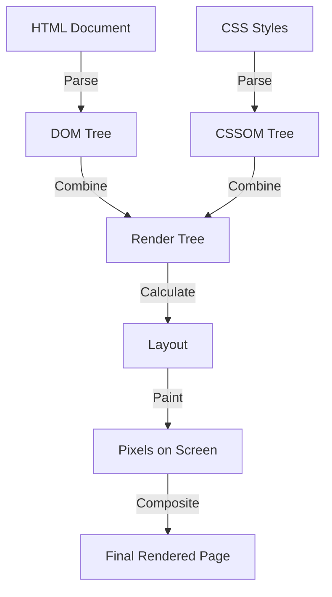

# HTML Interview Questions

## Table of Questions

<br/>

|Sl.No| Questions                                                                         |
|-----|-----------------------------------------------------------------------------------|
| 01.|[What is HTML and why is it used](#Q1)|
| 02.|[What are the new features introduced in HTML5](#Q2)|
| 03.|[New APIs introduced in HTML5](#Q3)|
| 04.|[How do you create a hyperlink in HTML](#Q4)|
| 05.|[Explain the difference between block and inline elements](#Q5)|
| 06.|[Purpose of `<head>` tag](#Q6)|
| 07.|[How to embed an image in HTML page.](#Q7)|
| 08.|[Explain semantic HTML and why is it important](#Q8)|
| 09.|[How to create a table](#Q9)|
| 10.|[Difference between HTML and XHTML](#Q10)|
| 11.|[How to include a video in HTML](#Q11)|
| 12.|[What is `doctype` used for. If you don't specify, what will happen](#Q12)|
| 13.|[DOM and DOM manipulation](#Q13)|
| 14.|[Different types of storage (local storage, session storage, cookies)](#Q14)|
| 15.|[Drag and drop in HTML5](#Q15)|
| 16.|[Form input types in HTML5](#Q16)|
| 17.|[`Datalist` tag in HTML5](#Q17)|
| 18.|[How browser renders HTML and CSS](#Q18)|
| 19.|[What are web workers](#Q19)|
| 20.|[Different types of script tags (`async`, `defer`)](#Q20)|


## Answers

#### Q1 
### ✨ What is HTML and why is it used

HTML (HyperText Markup Language) is the standard markup language used to create and design webpages. Here's why HTML is essential:

1. **Structure**: HTML provides the basic structure of a webpage. Elements like headings, paragraphs, lists, and links are all defined using HTML.

2. **Content**: HTML is used to embed text, images, videos, and other multimedia on web pages.

3. **Links**: HTML allows the creation of hyperlinks, which enable users to navigate between different web pages or sections within a single page.

4. **Accessibility**: HTML supports the use of tags that enhance the accessibility of web pages, making them usable by people with disabilities. For example, semantic tags and attributes like `alt` for images improve screen reader support.

5. **SEO**: HTML elements and attributes play a crucial role in Search Engine Optimization (SEO). Proper use of tags like `<title>`, `<meta>`, and header tags help search engines understand and index content, improving visibility in search results.

6. **Integration with Other Technologies**: HTML can be used in conjunction with CSS (Cascading Style Sheets) for styling and JavaScript for dynamic and interactive content.

<div align="left">
    <b><a href="#">↥ back to top</a></b>
</div>

#### Q2
### ✨ What are the new features introduced in HTML5

HTML5 introduced several new features and enhancements to improve the functionality, performance, and user experience of web applications. Here are some key features:

1. **Semantic Elements**: New tags like `<header>`, `<footer>`, `<section>`, `<article>`, `<aside>`, and `<nav>` provide better structure and meaning to web content, improving accessibility and SEO  .

2. **Multimedia Support**: Native support for audio and video through `<audio>` and `<video>` tags. These elements include built-in controls for play, pause, and volume.

3. **Canvas Element**: The `<canvas>` element allows for dynamic, scriptable rendering of 2D shapes and images, enabling complex graphics and animations directly within the browser without external plugins.

4. **Geolocation API**: This API enables web applications to access the geographical location of a user, which can be used for mapping, local search, and other location-based services .

5. **Web Storage**: HTML5 introduces `localStorage` and `sessionStorage` for storing data on the client side. This provides a more secure and efficient way to store data compared to cookies .

6. **Offline Capabilities**: The Application Cache allows web applications to run offline by storing resources like HTML, CSS, and JavaScript files locally, ensuring that web apps are accessible even without an internet connection  .

7. **Form Enhancements**: New input types (`email`, `url`, `date`, `number`, etc.) and attributes (`placeholder`, `required`, `pattern`, etc.) enhance form validation and user experience .

8. **Drag and Drop**: HTML5 includes a drag-and-drop API that simplifies the process of dragging elements within or between web pages .

9. **New APIs**: Additional APIs such as *Web Workers* for background processing, the *History API* for managing browser history, and the *WebSocket API* for real-time communication are also part of HTML5 .

<div align="left">
    <b><a href="#">↥ back to top</a></b>
</div>

#### Q3
### ✨ New APIs introduced in HTML5

Here are some examples of the new APIs introduced in HTML5 along with small code snippets demonstrating their usage:

**1. Geolocation API**
The Geolocation API allows web applications to obtain the geographical position of the user.

```html
<!DOCTYPE html>
<html lang="en">
<head>
    <meta charset="UTF-8">
    <title>Geolocation API</title>
</head>
<body>
    <button onclick="getLocation()">Get Location</button>
    <p id="location"></p>

    <script>
        function getLocation() {
            if (navigator.geolocation) {
                navigator.geolocation.getCurrentPosition(showPosition);
            } else {
                document.getElementById('location').innerText = "Geolocation is not supported by this browser.";
            }
        }

        function showPosition(position) {
            document.getElementById('location').innerText = 
                "Latitude: " + position.coords.latitude + 
                " Longitude: " + position.coords.longitude;
        }
    </script>
</body>
</html>
```

**2. Web Storage API**
The Web Storage API provides mechanisms for storing key-value pairs in a web browser. It includes `localStorage` and `sessionStorage`.

```html
<!DOCTYPE html>
<html lang="en">
<head>
    <meta charset="UTF-8">
    <title>Web Storage API</title>
</head>
<body>
    <button onclick="storeData()">Store Data</button>
    <button onclick="retrieveData()">Retrieve Data</button>
    <p id="output"></p>

    <script>
        function storeData() {
            localStorage.setItem('name', 'John Doe');
        }

        function retrieveData() {
            const name = localStorage.getItem('name');
            document.getElementById('output').innerText = name;
        }
    </script>
</body>
</html>
```

**3. Canvas API**
The Canvas API provides a means for drawing graphics via JavaScript.

```html
<!DOCTYPE html>
<html lang="en">
<head>
    <meta charset="UTF-8">
    <title>Canvas API</title>
</head>
<body>
    <canvas id="myCanvas" width="200" height="200" style="border:1px solid #000000;"></canvas>

    <script>
        const canvas = document.getElementById('myCanvas');
        const context = canvas.getContext('2d');
        
        context.fillStyle = '#FF0000';
        context.fillRect(50, 50, 100, 100);
    </script>
</body>
</html>
```

**4. Drag and Drop API**
The Drag and Drop API allows for drag-and-drop functionality.

```html
<!DOCTYPE html>
<html lang="en">
<head>
    <meta charset="UTF-8">
    <title>Drag and Drop API</title>
</head>
<body>
    <div id="drag1" draggable="true" ondragstart="drag(event)" style="width: 100px; height: 100px; background-color: #ff0000;"></div>
    <div id="dropZone" ondrop="drop(event)" ondragover="allowDrop(event)" style="width: 200px; height: 200px; border: 1px solid #000000;"></div>

    <script>
        function allowDrop(ev) {
            ev.preventDefault();
        }

        function drag(ev) {
            ev.dataTransfer.setData("text", ev.target.id);
        }

        function drop(ev) {
            ev.preventDefault();
            const data = ev.dataTransfer.getData("text");
            ev.target.appendChild(document.getElementById(data));
        }
    </script>
</body>
</html>
```

**5. Web Workers API**
Web Workers API allows running scripts in background threads.

```html
<!DOCTYPE html>
<html lang="en">
<head>
    <meta charset="UTF-8">
    <title>Web Workers API</title>
</head>
<body>
    <button onclick="startWorker()">Start Worker</button>
    <p id="result"></p>

    <script>
        let worker;

        function startWorker() {
            if (typeof(Worker) !== "undefined") {
                if (typeof(worker) == "undefined") {
                    worker = new Worker("worker.js");
                }
                worker.onmessage = function(event) {
                    document.getElementById("result").innerText = event.data;
                };
            } else {
                document.getElementById("result").innerText = "Sorry, your browser does not support Web Workers...";
            }
        }
    </script>
</body>
</html>
```

***worker.js***:
```javascript
let i = 0;

function timedCount() {
    i = i + 1;
    postMessage(i);
    setTimeout(timedCount, 500);
}

timedCount();
```

**6. Offline Capabilities (Application Cache)**
The Application Cache API allows a web application to run offline.

```html
<!DOCTYPE html>
<html lang="en" manifest="example.appcache">
<head>
    <meta charset="UTF-8">
    <title>Application Cache</title>
</head>
<body>
    <h1>Application Cache Example</h1>
    <p>This web page is cached for offline use.</p>
</body>
</html>
```

***example.appcache***:
```plaintext
CACHE MANIFEST
# 2023-05-30:v1

CACHE:
index.html

NETWORK:
*
```

<div align="left">
    <b><a href="#">↥ back to top</a></b>
</div>

#### Q4
### ✨ How do you create a hyperlink in HTML

To create a hyperlink using JavaScript and manipulate the DOM (Document Object Model), you can follow these steps:

1. *Create an anchor element (`<a>`).*
2. *Set the attributes (`href`, `target`, etc.).*
3. *Set the link text.*
4. *Append the anchor element to the desired location in the DOM.*

Example:

```html
<!DOCTYPE html>
<html lang="en">
<head>
    <meta charset="UTF-8">
    <title>Create Hyperlink with JavaScript</title>
</head>
<body>
    <div id="link-container"></div>

    <script>
        // Step 1: Create an anchor element
        const link = document.createElement('a');

        // Step 2: Set the href attribute and other properties
        link.href = 'https://www.example.com';
        link.target = '_blank'; // Open link in a new tab
        link.title = 'Go to Example.com';

        // Step 3: Set the link text
        link.textContent = 'Visit Example.com';

        // Step 4: Append the anchor element to the desired location
        document.getElementById('link-container').appendChild(link);
    </script>
</body>
</html>
```

<div align="left">
    <b><a href="#">↥ back to top</a></b>
</div>

#### Q5
### ✨ Explain the difference between block and inline elements

In HTML, elements are categorized into two main types: *block elements* and *inline elements*. The key differences between these types lie in their default behavior and layout characteristics.

|Features         | Block Elements                    | Inline Elements                   |
|-----------------|-----------------------------------|-----------------------------------|
| **Default Behavior**| Block elements always start on a new line and take up the full width available | Inline elements do not start on a new line. They sit within the flow of the surrounding content and only take up as much width as necessary |
| **Content**| They typically contain other block elements and inline elements like paragraphs, lists, and divs | They generally contain text or other inline elements. They are used for elements that need to be part of a line, such as links, emphasis, or images |
| **Layout**| They form a block-like structure, and their height and width can be controlled using CSS properties.  | Inline elements cannot have their width and height adjusted using CSS. Margins and padding can be applied but only affect spacing horizontally.  |
| **Common Block Elements**| `<div>`, `<p>`, `<h1>`, `<ul>`, `<ol>`, `<li>`, `<table>`, `<section>`, `<article>`, `<header>`, `<footer>`  | `<span>`, `<a>`, ``, `<strong>`, `<em>`, `<label>`, `<input>`, `<br>`, `<code>`  |

### Visual Representation
Imagine a web page layout:
- **Block Elements**: Think of them as building blocks stacked vertically. Each block (like a paragraph or a section) occupies its line.
- **Inline Elements**: Think of them as words within a sentence. They flow within the block elements and fit together horizontally.

<div align="left">
    <b><a href="#">↥ back to top</a></b>
</div>

#### Q6
### ✨ Purpose of `<head>` tag

The `<head>` tag in HTML serves several essential purposes. It contains metadata and links to resources necessary for rendering the webpage correctly but does not display content directly on the page. Here are the primary functions of the `<head>` tag:

1. **Metadata**:
The `<head>` section contains metadata about the HTML document, which provides information about the page to browsers, search engines, and other services.

- **Title**: The `<title>` tag sets the title of the webpage, displayed on the browser tab.

- **Meta Tags**: These provide additional metadata such as character set, author, description, and keywords.

2. **Links to External Resources**:
The `<head>` tag includes links to external resources required for the page.

- **Stylesheets**: Links to CSS files to style the webpage.

- **Scripts**: Links to JavaScript files, typically those that should be loaded before the content.

- **Favicon**: A link to the favicon, which is the small icon displayed in the browser tab.

3. **SEO and Accessibility**:
The `<head>` section includes elements that improve SEO and accessibility.

- **Open Graph Tags**: Used by social media platforms to display rich content when links are shared.

- **Charset Declaration**: Specifies the character encoding for the HTML document.

4. **Performance and Optimizations**:
- **Preconnect and Prefetch**: These tags help in improving performance by preconnecting to required domains and prefetching resources.

**Example of a Complete `<head>` Tag**:
```html
<head>
    <title>My Webpage</title>
    <meta charset="UTF-8">
    <meta name="description" content="An example webpage">
    <meta name="keywords" content="HTML, CSS, JavaScript">
    <meta name="author" content="John Doe">
    <link rel="stylesheet" href="styles.css">
    <script src="script.js" defer></script>
    <link rel="icon" href="favicon.ico" type="image/x-icon">
    <meta property="og:title" content="My Webpage">
    <meta property="og:description" content="A detailed description of my webpage">
    <meta property="og:image" content="http://example.com/image.jpg">
    <link rel="preconnect" href="https://example.com">
    <link rel="prefetch" href="styles.css">
</head>
```

<div align="left">
    <b><a href="#">↥ back to top</a></b>
</div>

#### Q7
### ✨ How to embed an image in HTML page. (Hint: ``)


<div align="left">
    <b><a href="#">↥ back to top</a></b>
</div>

#### Q8
### ✨ Explain semantic HTML and why is it important


<div align="left">
    <b><a href="#">↥ back to top</a></b>
</div>

#### Q9
### ✨ How to create a table


<div align="left">
    <b><a href="#">↥ back to top</a></b>
</div>

#### Q10
### ✨ Difference between HTML and XHTML


<div align="left">
    <b><a href="#">↥ back to top</a></b>
</div>

#### Q11
### ✨ How to include a video in HTML


<div align="left">
    <b><a href="#">↥ back to top</a></b>
</div>

#### Q12
### ✨ What is `doctype` used for. If you don't specify, what will happen


<div align="left">
    <b><a href="#">↥ back to top</a></b>
</div>

#### Q13
### ✨ DOM and DOM manipulation


<div align="left">
    <b><a href="#">↥ back to top</a></b>
</div>

#### Q14
### ✨ Different types of storage (local storage, session storage, cookies)


<div align="left">
    <b><a href="#">↥ back to top</a></b>
</div>

#### Q15
### ✨ Drag and drop in HTML5


<div align="left">
    <b><a href="#">↥ back to top</a></b>
</div>

#### Q16
### ✨ Form input types in HTML5


<div align="left">
    <b><a href="#">↥ back to top</a></b>
</div>

#### Q17
### ✨ `Datalist` tag in HTML5


<div align="left">
    <b><a href="#">↥ back to top</a></b>
</div>

#### Q18
### ✨ How browser renders HTML and CSS

The process by which a browser renders HTML and CSS involves several steps, transforming raw code into a visual representation. Here's a high-level overview of the process:

**Steps in the Rendering Process**

1. **Parsing HTML**:
   - The browser parses the HTML document and constructs the *Document Object Model (DOM)* tree.
   - The DOM is a tree-like structure representing the HTML document, where each node is an object representing a part of the document.

2. **Parsing CSS**:
   - The browser parses the CSS and creates the *CSS Object Model (CSSOM)* tree.
   - The CSSOM is a tree-like structure that represents the CSS rules and their relationships.

3. **Constructing the Render Tree**:
   - The browser combines the DOM and CSSOM to create the *Render Tree*.
   - The render tree consists of visual elements that are to be displayed on the screen. It includes only the nodes required for rendering (e.g., it omits non-visual elements like `<head>`).

4. **Layout**:
   - The browser calculates the *layout* of each element based on the render tree.
   - It determines the exact position and size of each element on the page.

5. **Painting**:
   - The browser *paints* the render tree to the screen.
   - This involves filling in pixels based on the calculated layout and styles.

6. **Compositing**:
   - The browser may break the painting process into multiple layers and *composite* them into a final image.
   - This step is particularly important for complex pages with animations, fixed positions, and transformations.

### Diagram of the Rendering Process:

Here's a simplified diagram representing these steps:



### Detailed Explanation with Examples:

1. **Parsing HTML to DOM**:
   - Example HTML:
     ```html
     <html>
       <body>
         <div class="container">
           <h1>Hello World</h1>
           <p>This is a paragraph.</p>
         </div>
       </body>
     </html>
     ```
   - Corresponding DOM Tree:
     ```
     Document
     ├── html
         ├── body
             ├── div (class="container")
                 ├── h1
                 ├── p
     ```

2. **Parsing CSS to CSSOM**:
   - Example CSS:
     ```css
     .container {
       width: 100%;
     }
     h1 {
       color: blue;
     }
     p {
       color: gray;
     }
     ```
   - Corresponding CSSOM Tree:
     ```
     CSSOM
     ├── .container { width: 100%; }
     ├── h1 { color: blue; }
     ├── p { color: gray; }
     ```

3. **Constructing the Render Tree**:
   - The render tree includes visual elements:
     ```
     Render Tree
     ├── body
         ├── div (width: 100%)
             ├── h1 (color: blue)
             ├── p (color: gray)
     ```

4. **Layout Calculation**:
   - The layout step involves calculating positions and sizes of elements:
     ```
     Layout
     ├── body (position: 0, 0)
         ├── div (position: 0, 0, width: 100%)
             ├── h1 (position: 0, 0, color: blue)
             ├── p (position: 0, 20, color: gray)
     ```

5. **Painting and Compositing**:
   - The final step is painting the elements onto the screen and compositing them into the final image.

<div align="left">
    <b><a href="#">↥ back to top</a></b>
</div>

#### Q19
### ✨ What are web workers


<div align="left">
    <b><a href="#">↥ back to top</a></b>
</div>

#### Q20
### ✨ Different types of script tags (`async`, `defer`)

In HTML, the `<script>` tag is used to embed or reference JavaScript code. The attributes `async` and `defer` can be used with the `<script>` tag to control how scripts are loaded and executed, improving the performance and user experience of web pages.

| Attribute   | Loading Behavior                | Execution Timing                           | Suitable For                               |
|-------------|---------------------------------|--------------------------------------------|--------------------------------------------|
| None        | Synchronous                     | Immediately after fetching, blocking HTML  | Scripts that modify the DOM as they load   |
| `async`     | Asynchronous                    | As soon as the script is downloaded        | Independent scripts like analytics         |
| `defer`     | Asynchronous                    | After HTML parsing is complete, in order   | Scripts that rely on the full DOM          |

**Examples**

**Default Behavior (Blocking)**
```html
<!DOCTYPE html>
<html lang="en">
<head>
    <title>Default Script</title>
</head>
<body>
    <p>This content may be blocked by the script loading.</p>
    <script src="script.js"></script>
</body>
</html>
```

**Async Example**
```html
<!DOCTYPE html>
<html lang="en">
<head>
    <title>Async Script</title>
</head>
<body>
    <p>This content will load without waiting for the script.</p>
    <script src="script.js" async></script>
</body>
</html>
```

**Defer Example**
```html
<!DOCTYPE html>
<html lang="en">
<head>
    <title>Defer Script</title>
</head>
<body>
    <p>This content will be parsed completely before the script executes.</p>
    <script src="script.js" defer></script>
</body>
</html>
```

Using `async` and `defer` appropriately can significantly enhance the performance and user experience of web pages by optimizing how scripts are loaded and executed.

<div align="left">
    <b><a href="#">↥ back to top</a></b>
</div>

